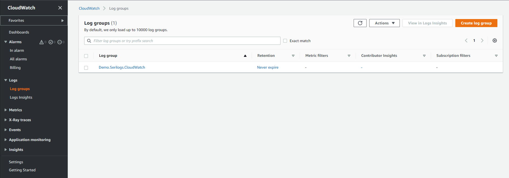
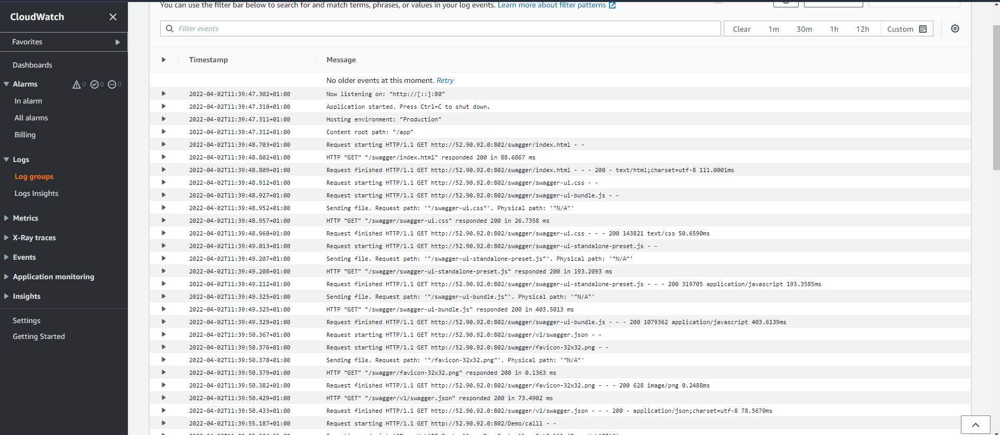

# demo-dotnet-serilog-aws-cloudwatch
Demo .NET with Serilog and AWS CloudWatch


## Dependencies
- [AWS.Logger.SeriLog](https://www.nuget.org/packages/AWS.Logger.SeriLog)
- [Serilog.AspNetCore](https://www.nuget.org/packages/Serilog.AspNetCore)
- [Serilog.Settings.Configuration](https://www.nuget.org/packages/Serilog.Settings.Configuration)
- [Serilog.Sinks.Async](https://www.nuget.org/packages/Serilog.Sinks.Async)


## Configure the project

### 1º `appsettings.json`
```json
{
  "Serilog": {
    "Using": [ "AWS.Logger.SeriLog", ... ],

    "LogGroup": "Demo.Serilogs.CloudWatch",
    "Region": "us-east-1",

    "MinimumLevel": {
      "Default": "Information",
      "System": "Information",
      "Microsoft": "Information",
      "Microsoft.Hosting.Lifetime": "Information",
      "Microsoft.AspNetCore": "Information"
    },
    "WriteTo": [
      {
        "Name": "Async",
        "Args": {
          "configure": [
            {
              "Name": "AWSSeriLog",
              "Args": {
                "formatter": "Serilog.Formatting.Compact.CompactJsonFormatter, Serilog.Formatting.Compact"
              }
            }
          ]
        }
      }
    ],
    ...
  },
  ...
}
...
```

- Use the key `Logging.Region` the set the AWS region for CloudWatch.
- Use the key `Logging.LogGroup` the set group name for logs in CloudWatch.


## Run project


### Build image
```bash
docker build -f ./Dockerfile --force-rm -t technobre/demo-dotnet-serilog-aws-cloudwatch .
```

### Run container
```bash
docker run -d --name=demo-dotnet-serilog-aws-cloudwatch -p 801:80 -t technobre/demo-dotnet-serilog-aws-cloudwatch .
```


## AWS

### IAM

#### 1º Create a new IAM policy
Allow write logs in CloudWatch

**Name:** `CW-Logs`
```json
{
    "Version": "2012-10-17",
    "Statement": [
        {
            "Sid": "AllowWriteLogsInCloudWatch",
            "Effect": "Allow",
            "Action": [
                "logs:CreateLogStream",
                "logs:DescribeLogGroups",
                "logs:DescribeLogStreams",
                "logs:CreateLogGroup",
                "logs:PutLogEvents"
            ],
            "Resource": "*"
        }
    ]
}
```


#### 2º Create a new IAM role
Role to allow EC2 instances to write logs in CloudWatch

**Name:** `EC2-Containers`


#### 3º Attach the role to the EC2


#### 4º Monitor logs




## References

- [Official documentation](https://github.com/aws/aws-logging-dotnet)

